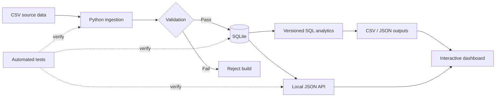

# ZIPSmart360

[](https://github.com/JJennings728/ZipSmart360/actions/workflows/tests.yml)

### Data Engineering · SQL Analytics · APIs · Decision Support

**A reproducible ZIP-level analytics pipeline built to show how validated source data becomes queryable, testable, and review-ready analytical output.**

[Portfolio](PORTFOLIO.md) · [Evaluation Memo](PORTFOLIO_EVALUATION.md) · [Architecture](docs/architecture.md) · [Data Dictionary](docs/data-dictionary.md)

## Overview

ZIPSmart360 is the executable engineering anchor of my portfolio. It demonstrates an end-to-end analytical workflow using Python, SQLite, SQL, a local JSON API, automated tests, and an interactive dashboard.

The project is intentionally lightweight and inspectable: no paid services, no hidden infrastructure, and no external API keys are required.

## Architecture



**Control principle:** invalid source data is stopped before it replaces the analytical database.

## What this repository demonstrates

| Area | Implementation |
| --- | --- |
| Ingestion | Structured CSV parsing with explicit schema expectations |
| Validation | Required fields, identifiers, duplicates, ranges, finite values, and year consistency |
| Storage | SQLite schema with primary key, constraints, and state index |
| Analytics | Explicit SQL aggregations stored in versioned files |
| API | Local JSON endpoints with input validation and HTTP error handling |
| Reporting | CSV, JSON, quality report, and interactive HTML dashboard |
| Verification | Automated tests covering calculations, repeatability, invalid input, SQL, and HTTP behavior |
| Documentation | Architecture notes, data dictionary, setup instructions, and reference outputs |

## Quick start

### Prerequisites

- Python 3.10+
- Git
- A modern web browser

No third-party Python packages are required for the core demonstration.

### 1. Clone the repository

```bash
git clone https://github.com/JJennings728/ZipSmart360.git
cd ZipSmart360
```

### 2. Run the tests

```bash
python -m unittest discover -s tests -v
```

On Windows, `py` can be used instead of `python`.

### 3. Build the analytical outputs

```bash
python zipsmart.py
```

### 4. Start the local API and dashboard

```bash
python server.py
```

Open:

```text
http://127.0.0.1:8000
```

The generated dashboard can also be opened directly from `build/dashboard.html`.

## API surface

| Endpoint | Purpose |
| --- | --- |
| `/api/health` | Service status and record count |
| `/api/zips` | Retrieve all demonstration records |
| `/api/zips?state=IA` | Filter records by state |
| `/api/zip?zip=00501` | Retrieve one ZIP while preserving leading zeros |

The API returns explicit 400, 404, and 503 responses for supported error conditions.

## Data-quality design

ZIPSmart360 treats analytical semantics and identifiers deliberately.

- ZIP codes are stored as text so values such as `00501` are not corrupted.
- Invalid datasets are rejected before replacing the existing SQLite database.
- Repeated builds from the same input generate reproducible text outputs.
- Technically valid calculations are kept separate from misleading interpretations. For example, the arithmetic mean of ZIP-level household-income medians is not labeled as a state median household income.

## Repository structure

```text
ZipSmart360/
├── .github/               # CI workflows
├── data/                  # Synthetic input fixture
├── docs/                  # Architecture and data dictionary
├── examples/              # Checked-in reference outputs
├── sql/                   # Schema and analytical SQL
├── tests/                 # Automated verification
├── web/                   # Dashboard template
├── aviation-ai-workflow/  # Synthetic aviation AI workflow reference
├── aviation-underwriting/ # Synthetic aviation underwriting portfolio
├── server.py              # Local JSON API
└── zipsmart.py            # Validation, build, analysis, and export pipeline
```

## Continuous integration

GitHub Actions runs the test suite and demonstration build on Python 3.10, 3.12, and 3.14 for pushes and pull requests. The workflow can also be started manually.

## Engineering principles

- **Traceability** — inputs, transformations, assumptions, and outputs should be inspectable.
- **Validation** — invalid conditions should be identified before they propagate downstream.
- **Separation of concerns** — ingestion, storage, analytical logic, APIs, and presentation remain distinct.
- **Reproducibility** — the same valid input should produce the same analytical output.
- **Human accountability** — analytics should support decisions without hiding uncertainty or limitations.

## Portfolio context

ZIPSmart360 supports a broader portfolio spanning applied AI, insurance analytics, commercial CAT exposure, reinsurance pricing, aviation underwriting, and data architecture.

Start here: **[Applied AI, Risk Analytics & Data Engineering Portfolio](PORTFOLIO.md)**

## Scope and limitations

This repository uses 12 explicitly synthetic records. It is a portfolio implementation, not a production geographic-risk platform, actuarial model, carrier system, or commercial API.

The local server binds to `127.0.0.1` and does not implement production authentication, billing, rate limiting, observability, or cloud deployment.

AI assistance was used in development. Public artifacts use synthetic or explicitly disclosed demonstration data where appropriate.

## Author

**James Jennings**  
Applied AI · Risk Analytics · Data Engineering · Insurance

[LinkedIn](https://www.linkedin.com/in/james-jennings-2053b4a8) · [GitHub](https://github.com/JJennings728)
