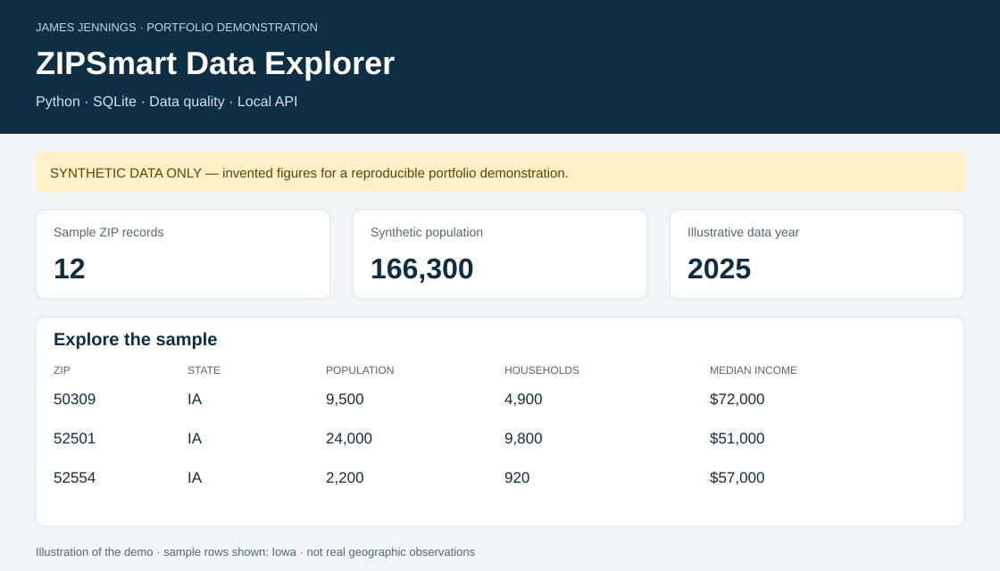

# ZIPSmart · ZIP-level data analytics demonstration

**James Jennings | Applied AI, risk analytics, data engineering, and insurance**

**Portfolio hub:** [Applied AI, Risk Analytics & Data Engineering](PORTFOLIO.md)

A runnable portfolio project showing how to validate a CSV, load it into SQLite, query geographic records, and communicate results through an interactive dashboard and a local JSON API.

**Portfolio review:** [Read the project evaluation memo](PORTFOLIO_EVALUATION.md).

**Additional domain portfolio:** [Insurance analytics, AI workflow design, facultative pricing, and aviation underwriting case studies](INSURANCE_ANALYTICS_PORTFOLIO.md).

**Commercial CAT exposure data engineering:** [Synthetic SOV cleansing, TIV reconciliation, data-quality controls, and model-readiness case study](COMMERCIAL_CAT_EXPOSURE_PORTFOLIO.md).

**Status:** working local demonstration. **Data:** 12 explicitly synthetic records. **Dependencies:** Python 3.10+ standard library only. No API keys, paid services, or database account required.

## Start here

```bash
git clone https://github.com/JJennings728/ZipSmart360.git
cd ZipSmart360
python zipsmart.py
python server.py
```

On Windows, use `py` in place of `python` if needed. Open **http://127.0.0.1:8000**. Stop the server with Ctrl+C. You can also open `build/dashboard.html` directly after the build; its filters work offline.



The illustration above summarizes the generated dashboard; it is not a browser screenshot. [View a saved example report](examples/dashboard.html) by downloading the HTML and opening it in a browser. GitHub's file viewer shows its source rather than running the page.

## Why this project

Risk and business analysts need to turn inconsistent geographic data into understandable, traceable outputs. This project focuses on that workflow: preserving identifiers, rejecting bad input, writing explicit SQL, and explaining the limits of the result.

| Capability | Evidence |
| --- | --- |
| Python data processing | `zipsmart.py`: CSV validation, SQLite ingestion, JSON/CSV/HTML exports |
| SQL analysis | `sql/schema.sql` and `sql/state_summary.sql`: constraints, index, grouped summaries |
| Data quality | Required fields, ZIP uniqueness, leading zeros, finite numbers, valid ranges, consistent year |
| API implementation | `server.py`: parameterized queries, input checks, JSON responses, clear error codes |
| Reporting | State and ZIP filters, responsive HTML, accessible table, explicit synthetic-data labels |
| Verification | `tests/test_pipeline.py`: aggregation, bad input, repeatability, database preservation, HTTP behavior |

## Reproduce and test

```bash
python -m unittest discover -s tests -v
python zipsmart.py --input data/sample_zip_data.csv --output build
```

The build creates `zipsmart.sqlite`, `zip_metrics.csv`, `zip_metrics.json`, `state_summary.json`, `quality_report.json`, and `dashboard.html` under `build/`. Builds from the same input produce identical text exports. Invalid CSV data is rejected before replacing an existing database. Generated files in `examples/` are checked-in reference outputs.

## API examples

With `python server.py` running, visit:

| URL | Result |
| --- | --- |
| `/api/health` | Status, synthetic-data label, and record count |
| `/api/zips` | All sample records |
| `/api/zips?state=IA` | Three Iowa-labeled sample records |
| `/api/zip?zip=00501` | One sample record with its leading-zero ZIP preserved |

Invalid parameters return 400. An absent ZIP returns 404. An unavailable database returns 503. These endpoints are implemented for this demo; the separate `ZipSmart360-App` repository contains earlier product concepts and is not the API contract for this code.

## Data and interpretation

All numeric values are invented. ZIP-like identifiers are illustrative, and some may represent special-purpose postal codes. They are **not verified geographic observations**, Census estimates, or production customer data. `data_year=2025` is an illustrative label, not a collection date. No ZIP-to-state geographic validation is performed.

State totals describe only rows in this small sample. `mean_of_zip_income_medians` is an unweighted arithmetic mean of the sample ZIP income medians; it is **not** a state median household income. No OpportunityScore, GrowthScore, StabilityScore, actuarial pricing model, or validated risk prediction is implemented. See [the data dictionary](docs/data-dictionary.md) and [architecture](docs/architecture.md).

## Power BI handoff

Import `build/zip_metrics.csv` with **Get data → Text/CSV**. Set `zip_code` to **Text** before loading so leading zeros survive. Use state as a slicer and a table for ZIP, population, households, income, and unemployment. Keep the synthetic-data label visible. This repository provides the input export; it does not contain a completed `.pbix` report.

## Scope and authorship

This is an AI-assisted portfolio implementation prepared for James Jennings. It demonstrates an executable workflow, not a claim of independent authorship, paid client delivery, or production deployment. The code and tests are available for review and explanation.

The server binds only to `127.0.0.1`. It has no authentication, billing, rate limiting, or production hosting configuration. Do not expose it as a public service. The next stage would be a separately reviewed real-data pipeline with provenance, licensing, geography checks, uncertainty handling, and operational controls.

## Contact

[James Jennings on LinkedIn](https://www.linkedin.com/in/james-jennings-2053b4a8) · [GitHub](https://github.com/JJennings728)
