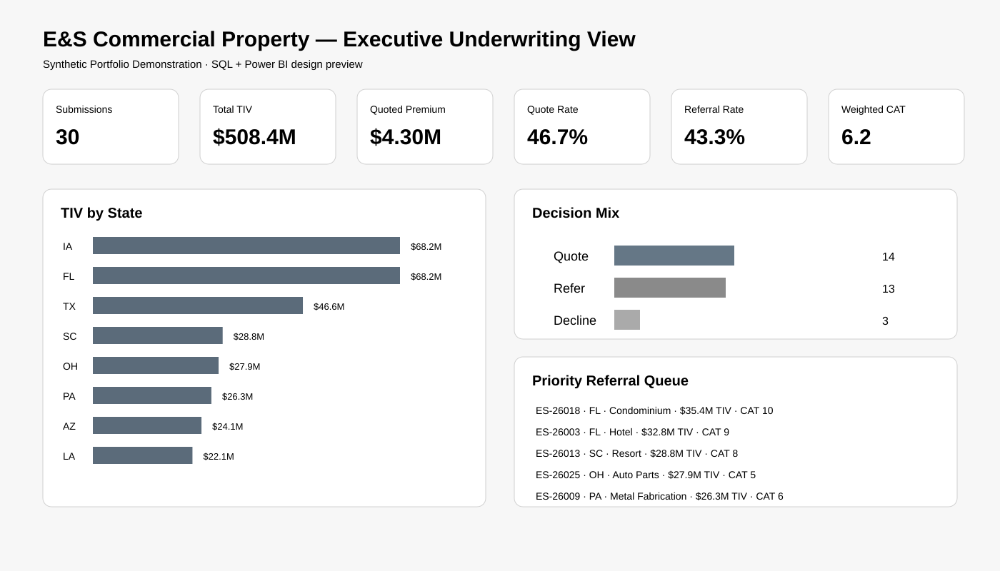
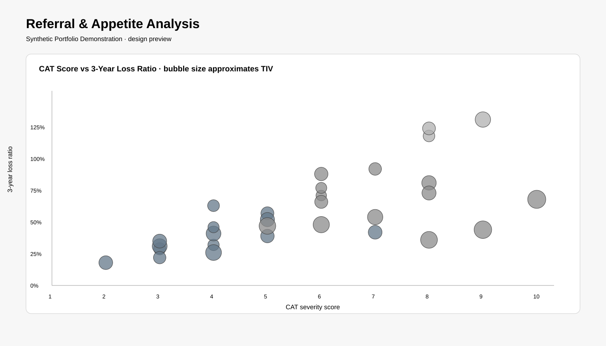

# E&S Commercial Property Underwriting — SQL + Power BI Portfolio

**James Jennings | E&S Insurance · P&C Risk · SQL · Power BI Analytics**

This synthetic commercial-property underwriting portfolio demonstrates how submission data can be converted into structured decision support using SQL, Power BI-ready modeling, DAX, exposure analytics, and transparent referral logic.

## Business decision

**Which submissions can proceed within demonstrated appetite, which require senior referral, and which should be declined or restructured based on exposure, catastrophe severity, protection, loss experience, capacity, and pricing context?**

The model organizes risk information for professional review; it does not replace underwriting judgment.

## What this demonstrates

- SQL transformation and portfolio aggregation
- Power BI-ready data modeling and DAX measures
- TIV and limit concentration analysis
- CAT severity, loss-ratio, protection, and hazard screening
- requested-versus-quoted rate analysis
- Quote / Refer / Decline workflow analytics
- explicit human-review reasons and auditable assumptions

## Repository structure

    powerbi-underwriting/
    ├── README.md
    ├── data/submissions.csv
    ├── data/DATA_DICTIONARY.md
    ├── sql/underwriting_model.sql
    ├── powerbi/measures.dax
    ├── powerbi/BUILD_GUIDE.md
    └── docs/*.svg

## Underwriting KPIs

| KPI | Purpose |
|---|---|
| Total TIV | Gross insured-value exposure |
| Total Limit | Requested deployed capacity |
| Quoted Premium | Rate-to-premium translation |
| Quote / Referral / Decline Rate | Workflow outcome mix |
| Weighted CAT Score | Exposure-weighted catastrophe severity |
| High CAT TIV % | Concentration in CATScore 8–10 |
| Average 3-Year Loss Ratio | Synthetic historical loss quality |
| Average Deductible | Insured risk retention |
| Rate Change % | Requested versus demonstrated quoted pricing |

## PBIX status

A proprietary .pbix binary is not fabricated here. The repository contains the dataset, SQL, DAX, visual specification, and exact build instructions needed to create the report in Power BI Desktop. After opening the project in Desktop, save the finished report as powerbi/ES-Commercial-Property-Underwriting.pbix.

## Dashboard previews

The SVGs are design previews generated from the synthetic portfolio, not screenshots falsely represented as Power BI Desktop output. After the PBIX is created, they can be supplemented with exported Power BI screenshots.

## Scope and limitations

All entities, brokers, submissions, rates, losses, hazard grades, CAT scores, values, and outcomes are synthetic. The decision and pricing logic is illustrative only. This is not an actuarial model, insurance quotation, binding authority, carrier guideline, or recommendation on an actual risk.

## Portfolio value

This artifact makes the claim **SQL & Power BI Analytics** independently reviewable: raw data, definitions, SQL transformations, DAX measures, KPI design, and the underlying business decision are visible and explainable.